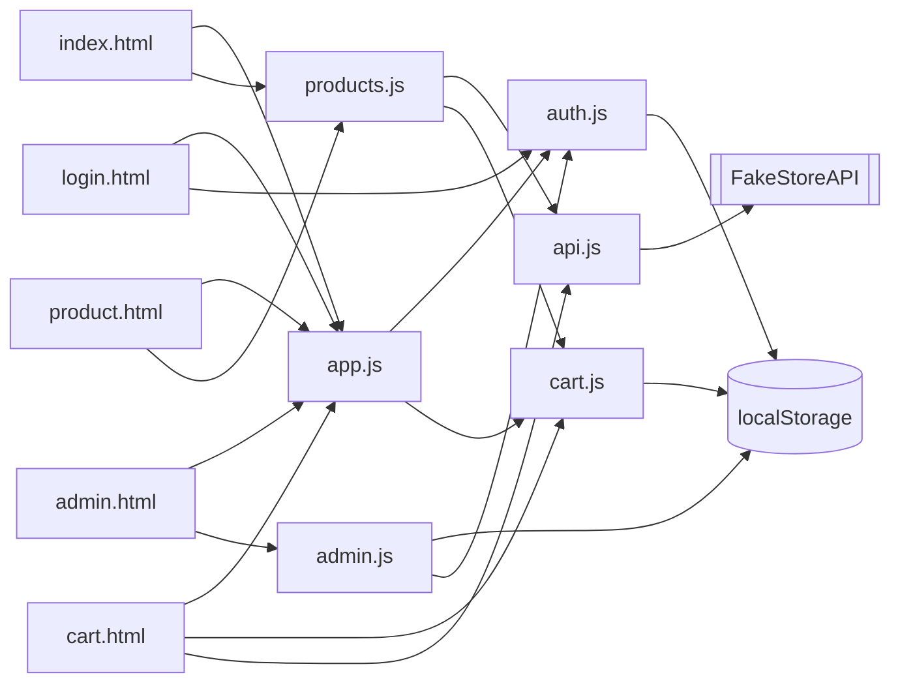

Live Demo
Add your deployed URL here:

https://novamart24.netlify.app/

📦 GitHub Repository
Add your GitHub repository here:

https://github.com/ParthPatil9406/ecommerce-capstone/edit/main/README.md
# Aperture Storefront

A multi-page e-commerce capstone: live product catalog, product detail
pages, a cart with persistent state, simulated authentication, and an
admin CRUD panel — plain HTML/CSS/JS, no framework, no build step.

**Live demo:** _add your deployed URL here after publishing (see Deployment)_

## Pages

| Page | Purpose |
|---|---|
| `index.html` | Catalog: search, category tabs, sort, add to cart |
| `product.html` | Single product detail (`?id=`), add to cart |
| `cart.html` | View/edit cart, quantities, remove items, simulated checkout |
| `login.html` | Simulated sign-in (any username; `admin` unlocks the admin panel) |
| `admin.html` | Gated CRUD — create/edit/delete managed listings |

## Modules (`js/`)

| File | Responsibility |
|---|---|
| `storage.js` | One `localStorage` wrapper (get/set/remove) every other module builds on — fails soft on quota errors or disabled storage |
| `api.js` | Async REST client for [FakeStoreAPI](https://fakestoreapi.com); every call has a timeout and throws a plain, readable `Error` |
| `auth.js` | Simulated session (`login`/`logout`/`getCurrentUser`/`isAdmin`) |
| `cart.js` | Cart data functions + the `cart.html` page controller |
| `products.js` | Catalog rendering (`index.html`) + product detail rendering (`product.html`) |
| `admin.js` | CRUD over admin-owned listings + the `admin.html` page controller |
| `app.js` | Shared chrome on every page: nav auth slot, cart badge, theme toggle |

## Architecture



`api.js` never touches the DOM or `localStorage` directly; `auth.js`,
`cart.js`, and `admin.js` never make network calls; every page loads
`app.js` for shared chrome, plus the one module that runs its own content.

## Setup

No dependencies or build tooling. Because every page uses ES module
`<script type="module">`, serve it locally rather than opening via `file://`:

```bash
npx serve .
# or
python3 -m http.server 8000
```

Visit `http://localhost:8000`.

## Deployment

Static site — any static host works:

**Netlify (fastest, no CLI)**
1. https://app.netlify.com/drop
2. Drag this folder onto the page
3. Copy the live URL it gives you into this README

**GitHub Pages**
1. Push this repo to GitHub
2. Settings → Pages → Source: `main`, `/ (root)`
3. Publishes at `https://<username>.github.io/<repo>/`

**Vercel**
1. Push to GitHub → https://vercel.com/new → import → Deploy

## Known limitations

- Auth is simulated — no password, no server; signing in as `admin`
  is a convenience for reaching the admin panel, not a security boundary.
- FakeStoreAPI is read-only, so admin CRUD operates on locally-stored
  "managed listings" rather than writing back to the product API.
